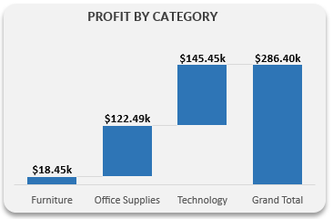
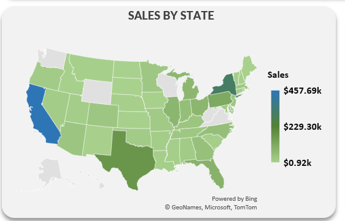
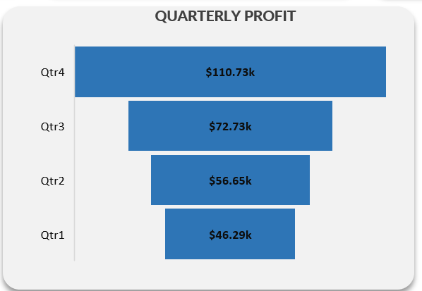

# Ecommerce Sales Analysis

## Introduction
This is an Excel e-commerce sales analysis of an imaginary store named **Ecommerce Sales** The project aims to analyze and derive insights from the provided data to answer business questions that will facilitate data-driven decision-making.

## Skills / Concepts Demonstrated
The following Excel features were incorporeted
- Data Cleaning
- Data Manipulation
- Pivot Tables
- Calculated Columns
- Slicers
- Visualization

## Problem Statement
- What is the profit and sales monthly turnover?
- What is the distribution of sales across product category?
- Which product is most profitable?
- What is the distribution of sales by state?
- What is the quarterly profit trend?
- Which products are bestsellers?

## Visualization
The report comprises six charts and five KPIs that help us generate insights into overall business performance.

   

   
You can interact with the report [here](<iframe width="402" height="346" frameborder="0" scrolling="no" src="https://onedrive.live.com/embed?resid=CD385A28D9191CCD%21350&authkey=%21AP1D1TjSrEBw_HU&em=2&wdHideGridlines=True&wdHideHeaders=True&wdDownloadButton=True&wdInConfigurator=True&wdInConfigurator=True"></iframe>)

Kindly note that Excel web does not support some features in the dashoard.

  ## Analysis
 ### Profit and Sales Monthly Trends

  

This Combo chart displays the monthly profit and sales trends of the data and help identify periods with high sales and profits turnover.

### Sale by Category.

   
   
The pie-chart is use to identifies the distribution of sales across different Ecommerce product category and generate insights to the popularity of the Ecommerce product categories and their overall sales contribution. As seen in the chart,**Technology** products are more popular and generates more sales.

### Profits by Category.

 
 
Waterfall chart is used to identify the distribution of profit across product categories from the smallest to largest. The chart shows **Technology** as the profitable product.

### Sales by State.

  
  
This map shows states with high sales and help us determine the states to target in our advertising campaigns.

### Quarterly Profits

 

 The puropse of this chart is to help us gain insights into quarterly profit performance.

## Conclusion:

- In 2011, we noticed a growth of 12.21% in sales and a 27.47% increase in profit from the consumer segment.
- We observed an increase in the Technology product category of 37.15% in 2013 and 37.6% in 2014, as well as 36.20% in 2011, making it the bestselling product category.
- In 2014, we observed an increase in sales in states such as Texas ($43.42k), New York ($93.92k), Florida ($26.52k), and California ($146.73k).
- Quarterly profit consistently increased year-over-year, particularly in Q4. This trend ranged from $21.72k in 2011 to $23.31k in 2012, $34.04k in 2013, and $27.66k in 2014. This can be attributed to increased holiday shopping and year-end preparations. This trend is also reflected in the monthly sales, with notable increases in September, November, and December, respectively.

## Recommendations:

- It is evident that the most profitable customers are consumers. I suggest partnering with corporate businesses to supply them with office equipment, including free installation.
- Launch an advertising campaign targeted at customers in states like Kansas, Nebraska, Maine, and Tennessee. This campaign should address their specific needs.
- Consider adding exercise equipment to your product offerings to boost sales in Q1 and Q2, as many individuals include getting fit and healthy in their New Year's resolutions.
