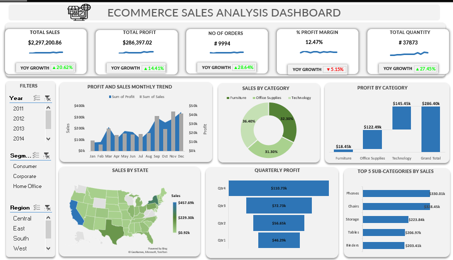
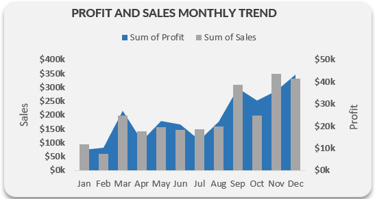
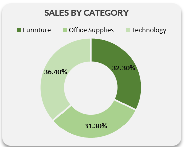

# Ecommerce Sales Analysis

## Introduction
This is an Excel e-commerce sales analysis of an imaginary store named **Ecommerce Sales** The project aims to analyze and derive insights from the provided data to answer business questions that will facilitate data-driven decision-making.

## Skills / Concepts Demonstrated
The following Excel features were incorporeted
- Data Cleaning
- Data Manipulation
- Pivot Tables
- Calculated Columns
- Slicers
- Visualization

## Problem Statement
- What is the profit and sales monthly turnover?
- What is the distribution of sales across product category?
- Which product is most profitable?
- What is the distribution of sales by state?
- What is the quarterly profit trend?
- Which products are bestsellers?

## Visualization
The report comprises six charts and five KPIs that help us generate insights into overall business performance.

   

  ## Analysis
 ### Profit and Sales Monthly Trends
This Combo chart displays the monthly profit and sales trends of the data and help identify periods with high sales and profits turnover.

###Sale by Categories.
The pie-chart is use to identifies the distribution of sales across different Ecommerce product category and generate insights to the popularity of the Ecommerce product category and their overall sales contribution. As seen in the chart, Technology products are more popular and generates more sales.

###Profits by Category.
Create a waterfall chart that identifies the distribution of profit across product categories and should be sorted from the smallest to largest.  This chart will identify the profitable products in order of hierarchy.
  

  

